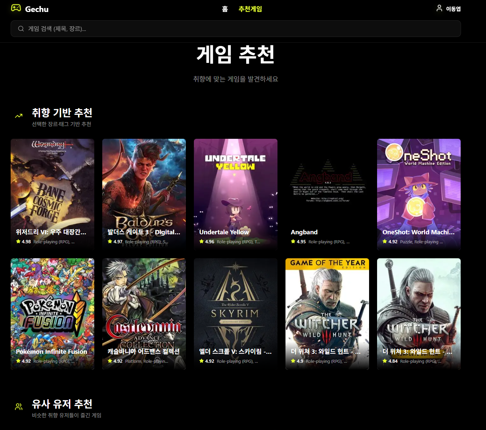

# Gechu Backend

## 📖 프로젝트 소개
**Gechu**는 유저의 취향과 행동 데이터를 기반으로 개인화된 게임을 추천하는 서비스입니다.  
단순 인기순 추천이 아니라, 사용자의 조회·검색·저장·외부 스토어 클릭 같은 행동 데이터를 추천 신호로 활용하고, 장르·플랫폼·태그 선호 정보까지 함께 반영해 더 실제적인 개인화 추천 경험을 제공하는 것을 목표로 했습니다.  
인증, 게임 탐색, 취향 관리, 행동 로그 수집, 추천 생성, 관리자 운영 기능까지 하나의 서비스 흐름으로 연결한 것이 이 프로젝트의 핵심입니다.

## 🔗 배포 링크
- 서비스: [https://gechu-frontend.vercel.app](https://gechu-frontend.vercel.app)
- 백엔드 Swagger: [https://d2c8om11rax5nb.cloudfront.net/api/schema/swagger-ui/](https://d2c8om11rax5nb.cloudfront.net/api/schema/swagger-ui/)
- 백엔드 ReDoc: [https://d2c8om11rax5nb.cloudfront.net/api/schema/redoc/](https://d2c8om11rax5nb.cloudfront.net/api/schema/redoc/)

## 🗣️ 프로젝트 발표 영상 & 발표 문서
- 진행 기간: `2026.02.19 - 2026.03.26`
- 발표 영상: 추가 예정
- 발표 문서: 추가 예정

## 🖥️ 서비스 소개

### 추천 페이지



| 구분 | 설명 |
| --- | --- |
| 로그인 / 회원가입 | 일반 로그인, 이메일 인증, 비밀번호 재설정, 카카오·디스코드 소셜 로그인 지원 |
| 홈 | 장르별 Top 10 게임 큐레이션 제공 |
| 게임 탐색 | 검색, 장르·플랫폼·태그 필터, 정렬, 페이지네이션 지원 |
| 게임 상세 | 트레일러, 스크린샷, 한국어 번역, 저장/좋아요/싫어요, 유사 게임 제공 |
| 마이페이지 | 프로필 관리, 선호 장르·플랫폼·태그 설정, 성인 인증, 최근 검색 관리 |
| 위시리스트 | 저장한 게임 목록과 선호 기반 연결 정보 제공 |
| 추천 페이지 | 사용자 행동 기반 개인화 추천 목록, 추천 상태 조회, 추천 새로고침 |
| 관리자 페이지 | 유저 관리, 활동 로그 조회, 추천 결과 확인, 추천 작업 운영 |

## 🧰 사용 스택

### Backend
- Django 6
- Django REST Framework
- PostgreSQL
- Redis
- Celery
- drf-spectacular (Swagger / OpenAPI)
- SimpleJWT
- django-filter
- boto3 / Pillow

### Frontend
- Next.js
- React
- TanStack Query
- Zustand
- Tailwind CSS
- Framer Motion
- React Hook Form
- Zod
- TypeScript

### Infra / DevOps
- Docker
- Docker Compose
- AWS S3
- AWS ECR
- Gunicorn

## 🔧 System Architecture
mermaid


## 👥 팀 동료

### Frontend
| 이름 | 역할 |
| --- | --- |
| 권희정 | 기획 총괄, 로그인/회원가입, 온보딩, 인증 공통 흐름 구현 |
| 오진석 | 검색, 위시리스트, 마이페이지, 관리자 페이지 구현 |
| 윤수영 | 홈, 게임 상세, 추천 페이지, 프론트 배포 담당 |

### Backend
| 이름 | 역할 |
| --- | --- |
| 이동엽 | 인증 구조 설계 및 리팩토링, 사용자/관리자 API, 소셜 로그인, 성인 인증, Swagger·테스트 정비 |
| 조현정 | 게임 목록/상세/유사 게임 API, 장르·플랫폼·태그 조회, IGDB 연동, 성인 필터링 |
| 윤영훈 | 선호도·행동 로그·추천 API, 추천 잡 운영 API, 추천 로직 및 비동기 구조 |

### Helper & Mentor
| 이름 | 역할 |
| --- | --- |
| 강지민 헬퍼 / 이준 코치 | 개발 문서, 초기 인프라, 외부 API 공통 구조, 기술 지원 |
| 배성희 멘토 | Next.js 구조 설계 및 프론트 구조 방향성 피드백 |
| 심준식 멘토 | 기술 선택 기준, 학습 자료 제공, 쿼리/성능 관점 피드백 |

## 📑 프로젝트 규칙

### Branch Strategy
- `main` / `dev` 브랜치를 기본으로 사용합니다.
- 기능 개발은 `feature/*`, 버그 수정은 `fix/*` 브랜치에서 진행합니다.
- `main`과 `dev`에는 직접 push 하지 않고 PR을 통해 반영합니다.
- PR 전 최소 1인 이상의 리뷰를 받는 것을 원칙으로 합니다.

### Git Convention
| 접두사 | 설명 |
| --- | --- |
| `Feat` | 새로운 기능 구현 |
| `Add` | 파일/에셋 추가 |
| `Fix` | 버그 수정 |
| `Docs` | 문서 추가 및 수정 |
| `Style` | 코드 스타일/포맷팅 |
| `Refactor` | 리팩토링 |
| `Test` | 테스트 코드 |
| `Deploy` | 배포 관련 |
| `Conf` | 빌드, 환경 설정 |
| `Chore` | 기타 작업 |

### Pull Request
- Title: `[Feat] 홈 페이지 구현` 형식으로 작성합니다.
- Description: 작업 내용을 구체적으로 작성합니다.
- Test: 로컬 확인 여부, 린트/테스트 결과를 함께 작성합니다.
- Discussion: 추후 논의가 필요한 사항이 있다면 함께 남깁니다.

### Code Convention
#### Backend
- 패키지명은 소문자를 사용합니다.
- 클래스명은 CamelCase를 사용합니다.
- 상수명은 `SNAKE_CASE`를 사용합니다.
- CRUD 계층 메서드는 `create`, `update`, `find`, `delete` 중심으로 통일합니다.
- 테스트 클래스는 `*Test` 형식으로 작성합니다.

#### Frontend
- 이벤트 핸들러는 `handle*` 형식으로 작성합니다.
- 화살표 함수를 기본으로 사용합니다.
- export 방식은 일관성 있게 유지합니다.
- 컴포넌트와 스타일 구조를 분리해 가독성을 유지합니다.

### Communication Rules
- Discord를 주요 커뮤니케이션 도구로 사용했습니다.
- 정기 회의와 수시 공유를 통해 API, 인증 흐름, 응답 구조를 맞췄습니다.
- 문서와 테스트를 함께 정리해 협업 비용을 줄이는 것을 목표로 했습니다.

## 📋 Documents
- API 명세서: 추가 예정
- 요구사항 정의서: 추가 예정
- ERD: 추가 예정
- 테이블 명세서: 추가 예정
- 화면 정의서: 추가 예정

## 🚀 실행 방법

### 1. Infra only
```bash
make infra
```

### 2. Full stack
```bash
make up
```

### 3. Test
```bash
make test
```

### 4. Code Quality
```bash
make check
```

## 📚 주요 기능 요약
- HttpOnly 쿠키 + CSRF 기반 인증 구조
- 일반 로그인 / 소셜 로그인 / 이메일 인증 / 비밀번호 재설정
- 게임 목록 / 상세 / 유사 게임 / 장르·플랫폼·태그 조회
- 사용자 선호도 저장 및 게임 반응 관리
- 행동 로그 기반 추천 엔진
- 추천 생성 상태 관리 및 비동기 추천 작업 처리
- 관리자용 유저/추천 운영 기능
